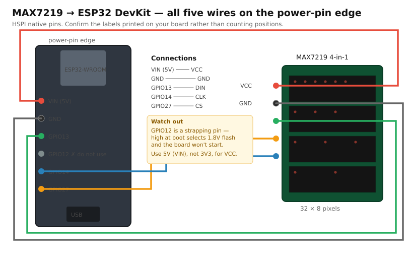

# Wiring — MAX7219 to ESP32



All five wires land on **one edge of the board — the edge carrying VIN and GND**, so a single
5-way connector reaches everything and nothing crosses over the module.

| MAX7219 | ESP32 | Why this pin |
|---|---|---|
| VCC | **VIN (5V)** | Not 3V3 — see power note below |
| GND | **GND** | Adjacent to VIN on the same edge |
| DIN | **GPIO13** | HSPI native MOSI |
| CLK | **GPIO14** | HSPI native SCK |
| CS  | **GPIO27** | Safe output; see the GPIO12 warning |

> **Find these five labels on your board rather than counting pin positions.** ESP32 DevKits
> ship in 30-pin and 38-pin variants whose physical ordering differs, but every one of them
> silkscreens the pin names. The five above are what matter.

## Why GPIO27 for CS, and not the closer GPIO12

On most DevKits, GPIO12 sits right between GPIO13 and GPIO14 — physically it's the obvious
choice, and it would make the five wires perfectly consecutive.

Don't use it. **GPIO12 is the MTDI strapping pin**: the ESP32 samples it at reset to choose the
internal flash voltage. It must read LOW at boot. A CS line that floats high, or a module with a
pull-up on CS, makes the chip select 1.8V flash — and the board then fails to boot until you pull
the wire off. It looks exactly like a dead board.

GPIO27 costs one non-adjacent wire and removes the failure mode entirely.

## Why HSPI

GPIO14 and GPIO13 are HSPI's native IOMUX pins for SCK and MOSI. Driving the bus through IOMUX
rather than the GPIO matrix keeps the signal path direct — which matters more later, when P10
refresh timing gets tight. The firmware therefore uses `SPI2_HOST`.

CS on GPIO27 does route through the GPIO matrix, which is fine: CS only toggles once per
transaction, not once per bit.

## Power

The MAX7219 needs **5V on VCC**. At 3.3V the LEDs are dim, and the chip's logic thresholds stop
matching the ESP32's output cleanly, which shows up as flickering or garbage rather than as an
obvious failure.

A fully lit 4-module board can draw **well over 500mA**. USB bus power is enough for bring-up at
the default intensity of 2, but raising brightness with everything lit will brown out the
regulator and reset the ESP32 mid-frame. For anything sustained, feed the module from an external
5V supply and **tie the grounds together** — the data lines are referenced to GND, so a floating
ground gives unreliable output even when the LEDs light.

## Changing the pins

```bash
cd firmware
idf.py menuconfig     # → Arabic LED text pipeline → MAX7219 wiring
idf.py -p /dev/ttyUSB0 flash
```

Avoid GPIO 34/35/36/39 for any of these: they are **input-only** and cannot drive a signal.
Also avoid GPIO0 and GPIO2 (boot strapping) and GPIO6–11 (wired to the internal SPI flash).
